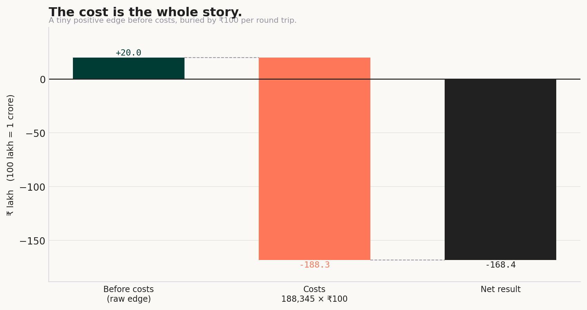
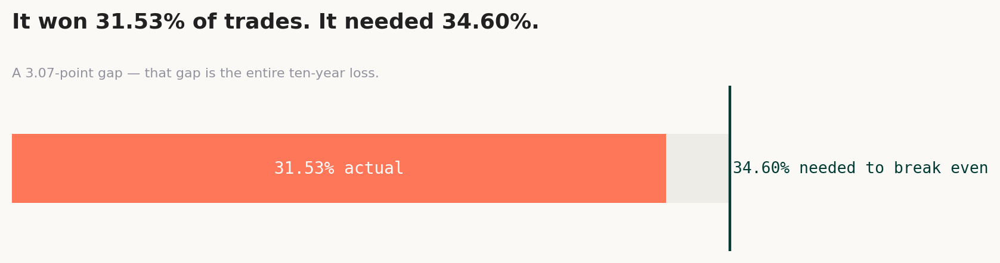
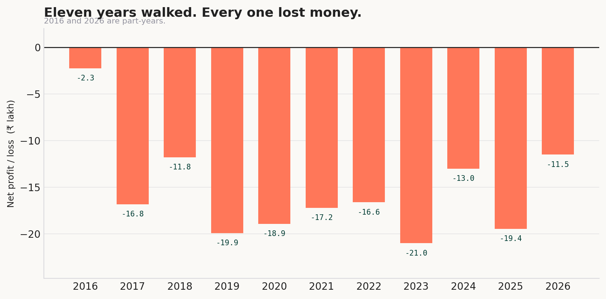
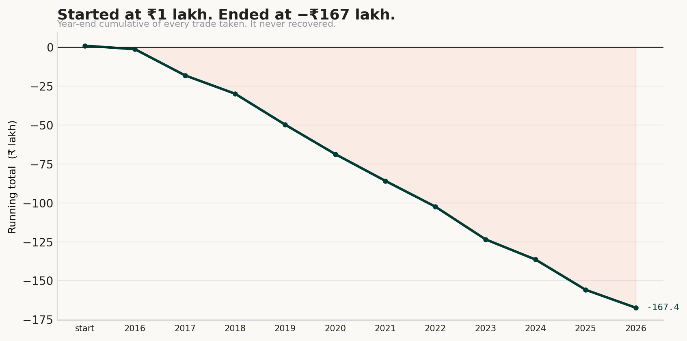
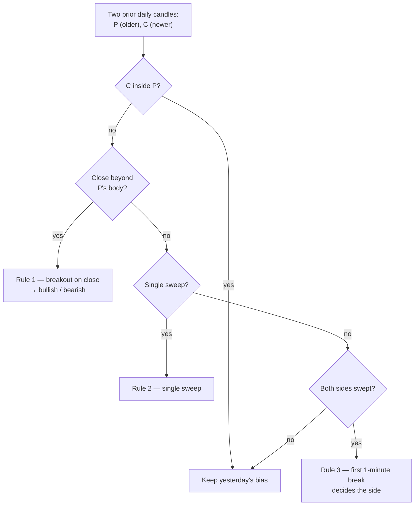
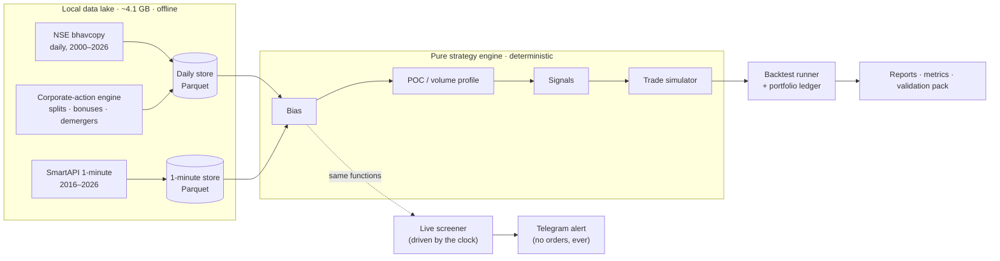
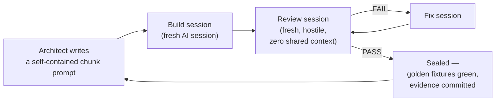

# Acumen Intelligence

**A backtester and live screener for a discretionary trader's intraday NSE F&O strategy — built to find the truth about that strategy, and it did.**


> **The honest headline.** This tool ran one trader's exact intraday strategy over ten years of real NSE data — every signal, every stock, no discretion — and it **lost money in all eleven years walked**. That is not a bug. The tool's job was to tell the truth about the strategy, rigorously enough to be believed, and it did. The engineering story is how much discipline it took to make that answer trustworthy.

> **How it was built.** Acumen was built by AI coding agents in a strict build-then-adversarially-review loop — **no line of code shipped without a separate, hostile review** — under a human-owned process that carried every decision. The method, not just the tool, is the point of this repository. The full session-by-session record is committed under [`docs/`](docs/).

---

## Contents

- [What it does](#what-it-does)
- [The result](#the-result)
- [The strategy](#the-strategy)
- [Architecture](#architecture)
- [How it was built — the method](#how-it-was-built--the-method)
- [Correctness and verification](#correctness-and-verification)
- [What it deliberately does *not* do](#what-it-deliberately-does-not-do)
- [Repository tour](#repository-tour)
- [Running it](#running-it)
- [Author](#author)

---

## What it does

Two jobs, one engine.

1. **Backtest.** Replay a fixed strategy over a ~10-year local market-data lake (204 F&O stocks, minute-by-minute) and report — with full disclosures — exactly what it would have made or lost.
2. **Live screen.** Each trading morning, run the *same* engine against live data and send a Telegram alert the moment a trade sets up. **It never places an order.** A human always trades; the tool only watches and pings. This is structural and enforced, not a matter of configuration.

The strategy is specified once, in [`CONTEXT.md`](CONTEXT.md), and is never altered by code. The trader owns the rules; the code only ever executes them.

---

## The result

The strategy has a small *positive* edge before costs and a decisively negative one after. At ₹100 per round trip against ₹1,000 of risk, cost is 10% of the money at risk *before the market moves at all* — and the strategy takes 188,345 trades.



| | |
|---|---:|
| Trades taken | **188,345** (204 stocks · 2,428 trading days) |
| Profit before costs | **+₹19,98,481.80** |
| Costs — 188,345 × ₹100 | **−₹1,88,34,500.00** |
| **Net result** | **−₹1,68,36,018.20** |
| Win rate | **31.53%** |
| Break-even win rate | **34.60%** |
| Profit factor | **0.8708** |
| Expected payoff / trade | **−₹89.39** |

The entire ten-year loss reduces to a single gap: the strategy won 31.53% of its trades and needed 34.60% just to break even.



Every calendar year walked lost money — and it never recovered from its first peak.





> All figures are generated from the run's own ledger by [`src/acumen/report_9b.py`](src/acumen/report_9b.py); nothing is typed by hand. The full technical report is [`docs/reports/chunk9b_backtest_report.md`](docs/reports/chunk9b_backtest_report.md), and the plain-English validation pack the trader reviewed is [`docs/validation/trader_pack.md`](docs/validation/trader_pack.md).

---

## The strategy

Faithfully implemented, never second-guessed. Each trading day gets a **bias** decided the evening before, from the two prior daily candles:



A bullish day is long-only, a bearish day short-only. Then, from the first two hours (09:15–11:15), the engine builds a **volume profile** and finds the point of control (POC). From 11:15 it watches 15-minute candles: arm on the correct side of the POC, enter on the first candle that closes across it, stop at the entry candle's extreme, target at 3× the risk, square off by 15:15. One trade per stock per day, ₹1,000 fixed risk, position size floored to whole shares.

The exact, unabridged specification — including every edge case the trader ruled on — lives in [`CONTEXT.md`](CONTEXT.md).

---

## Architecture

Deterministic by design: pure functions from candles to decisions, wrapped in thin I/O layers. The live path and the backtester call the **same** engine functions, which is what makes "what you tested is what you're alerted on" literally true.



**Stack.** Python 3.10+ · pandas · pyarrow (Parquet flat-file stores) · SmartAPI + pyotp + requests (data access) · PyYAML (config) · pytest. Every runtime dependency is pinned exactly (`==`) to versions verified on the operator's machine. No database server, no cloud: the entire ~4.1 GB market-data lake is local Parquet, so backtests are fully offline and reproducible.

The data lake itself is a small engineering project: **435,641 stored symbol-days**, passed through a three-gate quality battery (volume sanity, integrity, corporate-action adjustment). 93.93% cleared all three; 210 F&O underlyings resolved to **204 settled** for trading and **6 quarantined** on data quality (APLAPOLLO, ASTRAL, IEX, NTPC, UPL, VBL) — named, never silently dropped.

---

## How it was built — the method

This is the part worth reading. Acumen was written by AI coding agents (Claude Code) inside a human-owned, review-gated process, and the discipline around that loop is what makes a money-touching tool built this way trustworthy.



The division of labour was explicit, and it is not hidden: the AI agents drafted the specification from the trader's rules, wrote the code, and reviewed it; the human owned the project — choosing the problem and the data, steering the sequence, insisting on the review gate, and carrying every strategy question back to the trader for a ruling.

The rules that held for every chunk of the build:

- **Every chunk is reviewed by a separate, adversarial session** with zero shared context from the build. No code is sealed on its author's own say-so. Reviews *failed* chunks and sent them back — repeatedly — and those failures are all in the record.
- **The STOP rule.** Any ambiguity the spec doesn't resolve is written to [`QUESTIONS.md`](QUESTIONS.md) and escalated to the trader — never guessed. On a tool where a wrong assumption costs real money, "I don't know, so I asked" is the correct behaviour, and it is enforced.
- **Golden fixtures define "done."** Hand-computed reference cases — verified against the trader's own TradingView charts — are the acceptance test for the strategy logic. The build isn't finished when the code runs; it's finished when the fixtures pass.
- **Defect-pins that must flip.** Every bug fix ships with a probe that *fails on the old code and passes on the fix* — proven both ways — so a regression can't quietly reappear.
- **Evidence, not assertions.** Any claim made from real market data is backed by a committed script plus its output under [`docs/evidence/`](docs/evidence/). A reviewer can re-run the proof.
- **Clean history, no secrets.** Secrets never enter git (verified across the entire history); commits are atomic; the audit trail is honest about what was and wasn't reviewed.

Two incidents in the record show the process doing its job:

- **A credential leak, caught by review.** A code-review session found API tokens being written to log files. The key was rotated, the logs purged, and a guard added with a probe that fails if it ever regresses — all documented in the review trail.
- **A data-loss recovery.** A destructive command once followed filesystem junctions into the market-data store and emptied it. The stores were rebuilt from source and **reconciled to the previously sealed numbers**, and a structural rule now keeps the stores outside the repository tree entirely so no git command can reach them.

The complete method — the build plan, per-chunk cards, session ledgers, and 28 review reports — is committed: [`plan.md`](plan.md), [`PROGRESS.md`](PROGRESS.md), [`STATUS.md`](STATUS.md), [`docs/reviews/`](docs/reviews/).

---

## Correctness and verification

- **2,621 automated tests** across 102 test files, covering the pure engine, the data layer, and the live path.
- **Live == backtest, proven.** A dedicated parity harness replays recorded market days through both the live screener and the backtester and checks they produce **byte-identical** signals, candle for candle. They match. This is the guarantee behind "what you tested is what you're alerted on."
- **Independent recomputation.** The reporting metrics were re-derived by hand in a separate review session rather than graded against the builder's own numbers — because a self-graded exam doesn't count.
- **Reconciliation.** All 495,312 walked symbol-days were streamed and recounted against the run manifest: 32 of 32 consistency checks agree, zero duplicate keys, costs and net P&L tie out on every one of the 188,345 rows.

---

## What it deliberately does *not* do

Stated plainly, because a backtest that hides its assumptions is worse than none.

- **Idealised fills.** Entries fill at the candle close, stops and targets at their exact levels — no slippage, no partial fills, no market impact. Real trading is worse, and on the stops it is worse every time.
- **No capital constraint.** Every signal is taken on every stock concurrently, with no cap — at its busiest the book held 90 positions and ₹4.21 crore of open stock. This was the trader's explicit choice ("show me the honest numbers with no limits"), not a claim of feasibility.
- **Survivorship bias.** The universe is *today's* F&O list walked backwards, an engineering shortcut that flatters large, liquid names.
- **Flat cost model.** ₹100 per round trip regardless of trade size — the figure the trader specified.
- **No order placement, ever.** The tool alerts; the human trades. This is a hard structural boundary.

---

## Repository tour

| Path | What's there |
|---|---|
| [`CONTEXT.md`](CONTEXT.md) | The frozen strategy specification and system requirements. Law; never edited by code. |
| [`plan.md`](plan.md) | The chunked build plan and per-chunk cards. |
| [`CLAUDE.md`](CLAUDE.md) | The working constitution every build/review session followed. |
| [`PROGRESS.md`](PROGRESS.md) · [`STATUS.md`](STATUS.md) · [`QUESTIONS.md`](QUESTIONS.md) | The honest ledgers — session log, chunk state, and open-question / ruling record. |
| [`src/acumen/`](src/acumen/) | 49 modules, ~42.8k lines. Pure engine (`bias`, `poc`, `signals`, `simulate`) + data, backtest, live, and reporting layers. |
| [`tests/`](tests/) | 2,621 tests across 102 test files, plus frozen golden fixtures. |
| [`docs/reviews/`](docs/reviews/) | 28 per-chunk adversarial review reports. |
| [`docs/reports/`](docs/reports/) | The full backtest report and per-stock breakdown. |
| [`docs/validation/`](docs/validation/) | The plain-English pack the trader read and confirmed. |
| [`docs/evidence/`](docs/evidence/) | Per-claim proof scripts and their committed outputs. |

---

## Running it

```bash
pip install -e ".[dev]"    # exactly-pinned runtime deps + pytest
python -m pytest           # the full suite (runs from a bare clone; src/ is on the test path)
```

Market data lives outside the repository tree (configured in `config.yaml`), so a fresh clone ships the code, the tests, and the full audit trail — not the licensed vendor data. The backtest, live screener, and data-backfill commands are documented in [`docs/morning_runbook.md`](docs/morning_runbook.md); the live screener sends nothing without explicit `--telegram --live-alerts` flags, and places no orders under any flag.

---

## Author

**Chinmoy Paul**
Data Science & Artificial Intelligence — IIT Guwahati

[](https://chinmoypaul.vercel.app/)
[](https://www.linkedin.com/in/chinmoy-paul)
[](https://github.com/chinmoypaul8897)
[](mailto:hello.chinmoypaul@gmail.com)

---

<sub>**All rights reserved.** This repository is public for portfolio and demonstration purposes only. It is not open source and is not licensed for reuse or redistribution. The trading strategy it implements is used with the owner's permission. Market data is proprietary to its vendors and is not included.</sub>
